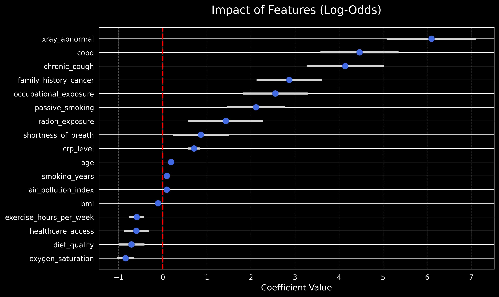
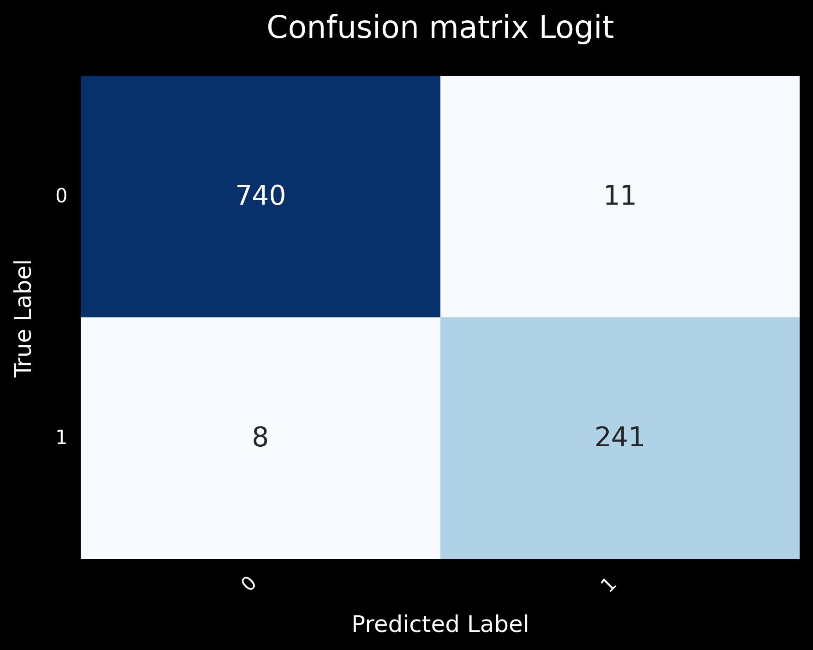
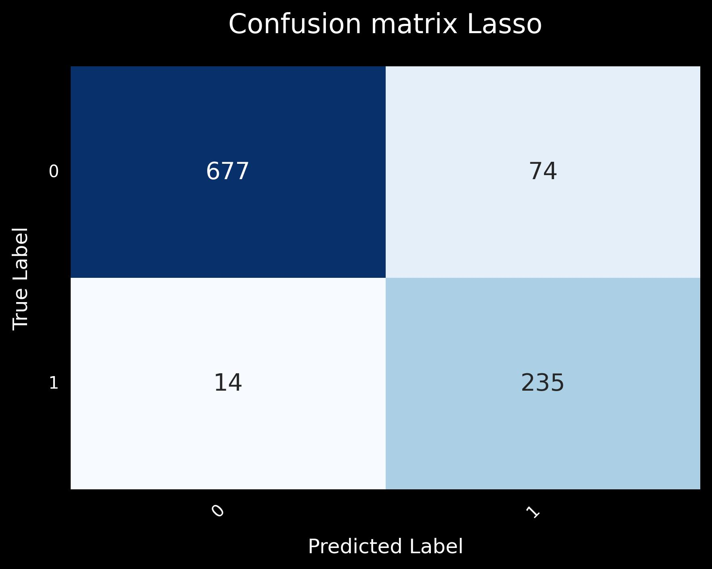
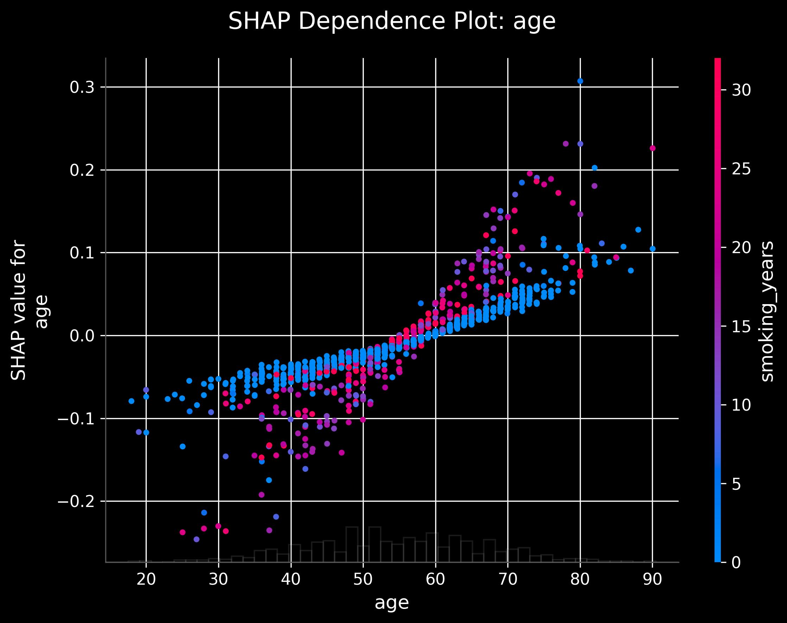
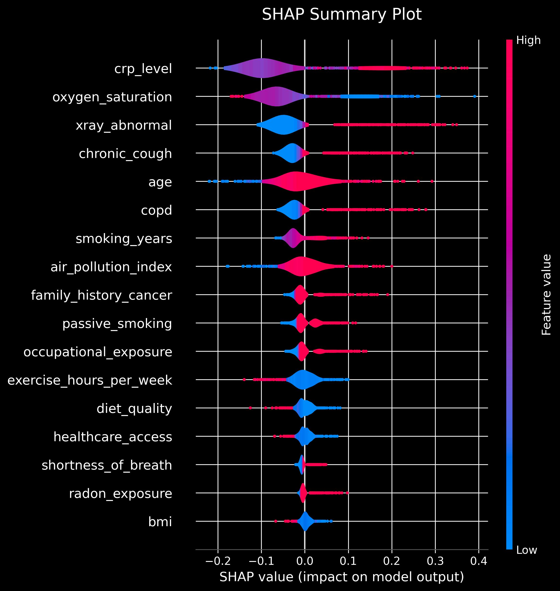
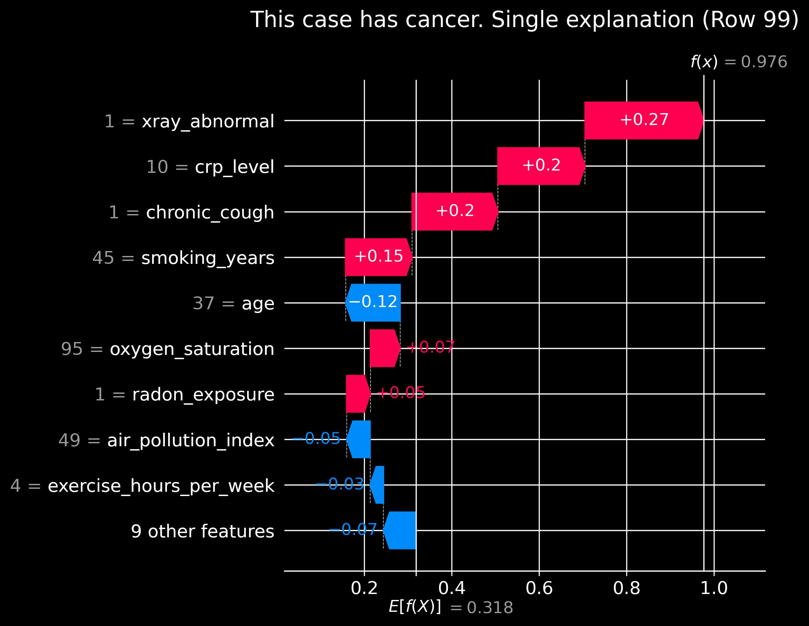

# Lung Cancer Risk Predictor 🫁📊


An interactive, end-to-end data science project demonstrating the lifecycle of a machine learning model from exploratory data analysis (EDA) to a fully deployed frontend application.

🔗 **[Live Demo: Lung Cancer Risk Predictor](https://migue-rc.github.io/biostatistics/)**

This project predicts the estimated probability of lung cancer based on various health, behavioral, and environmental features using a Logistic Regression model.

---

## 🎯 Project Goals

The objective of this repository is to serve as a comprehensive portfolio piece bridging the gap between Data Science and Web Development. It demonstrates:
1. **Data Science & Machine Learning:** Rigorous feature selection, model training, and interpretability using Python (Pandas, Scikit-Learn, SHAP).
2. **Frontend Engineering:** Translating static model weights into a live, interactive React application using TypeScript and Vite.

---

## 🔬 The Data Science Process

All research, data preprocessing, and modeling were conducted in Jupyter Notebooks (`/notebooks`).

### 1. Exploratory Data Analysis & Feature Selection
We began by analyzing the dataset to understand the relationships between different variables and the target (`lung_cancer_risk`). 

👉 **[View the EDA Notebook](notebooks/behavioral.ipynb)**
👉 **[View the Feature Selection Notebook](notebooks/features_selection.ipynb)**



### 2. Model Training (Logistic Regression vs Lasso)
We evaluated multiple models. Logistic Regression was ultimately chosen for its interpretability and ease of extraction (weights and intercept) for the frontend application.

👉 **[View the Modeling Notebook](notebooks/modeling.ipynb)**

<div style="display: flex; gap: 10px;">
  
  
</div>

### 3. Model Interpretability (SHAP Values)
To ensure the model makes decisions based on logical medical grounds, we used SHAP (SHapley Additive exPlanations) to explain individual predictions and global feature importance.

**Global Feature Importance:**


**SHAP Summary Plot:**


**Single Prediction Explanation:**


---

## 💻 The Frontend Application

The frontend is a React application built with Vite and TypeScript. It does not rely on a Python backend API. Instead, it computes the logistic regression probability entirely in the browser using the extracted `ols_weights.json` and `ols_weights_features.json`.

### Key Features
* **Real-time Inference:** The risk score updates instantly as sliders and checkboxes are manipulated.
* **Dynamic Color Scaling:** The risk indicator transitions smoothly from green (low risk) to yellow to red (high risk).
* **Data Context Integration:** The custom slider component overlays the actual histogram distribution of the dataset (via `feature_distributions.json`), allowing the user to see where their selected value falls relative to the population.

---

## 📁 Repository Structure

```text
├── notebooks/                   # Data Science Research
│   ├── data/                    # Raw datasets
│   ├── behavioral.ipynb         # EDA and Behavioral Analysis
│   ├── features_selection.ipynb # Feature Engineering
│   └── modeling.ipynb           # Model Training and Evaluation
├── public/                      # Static Assets
│   ├── plots/                   # Exported charts from notebooks
│   ├── feature_distributions.json # Data histograms for the UI
│   ├── ols_weights.json         # Extracted model weights
│   └── ols_weights_features.json# Feature names mapping
├── src/                         # React Frontend Code
│   ├── App.tsx                  # Main application logic
│   └── Slider.tsx               # Custom slider with integrated histogram
└── ...
```
